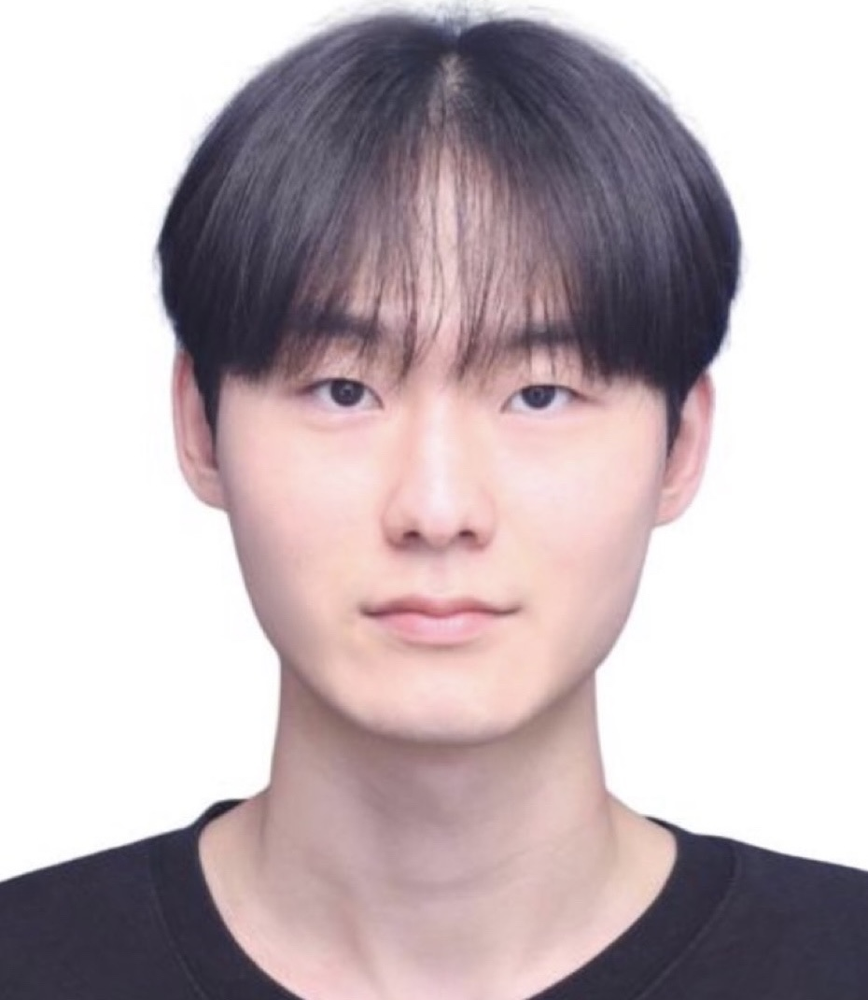

## About Me

Hi! I'm oxdjww
 
I am a undergraduate at Soongil University of Department of Software Engineering.

 

## Interest in..

I'm interested in server dev and information security.

 

## Educations

- Yangchung High School `2016.03 - 2019.02`
- Soonsil Univ `2019.03 - `
    - Major in Software Engineering
    - Convergence Major in Information Security
- [KITRI Best of The Best 12th](https://www.kitribob.kr/) `2023.06 - `
    - [Archive](https://github.com/bob-12th)

 

## Communities

- [ASC : Academic Security Club](https://www.notion.so/native/ASC-1e2e608c98c949a696f02b363480ae38?pvs=4&deepLinkOpenNewTab=true) `2022.09 - `
    - Club of Soongsil Univ. Software
    - [2022 Naver D2 Campus Partner](https://github.com/D2CAMPUS-PARTNER/2022-Kick-off)
    - [2023 KUCIS](https://www.kisia.or.kr/talent_support/kucis_info/)
- [UMC SpringBoot 4th](https://www.makeus.in/umc) `2023.03 - 2023.06`
- [UMC SpringBoot 5th](https://www.makeus.in/umc) `2023.09 - `
- [GDSC : Google Developer Student Clubs](https://gdsc.community.dev/) `2023.10 - `
    - [GDSC Soongsil Univ.](https://gdscsoongsil.pages.dev/)
    - Core Member : Part Lead (Server/Cloud)

 

## Projects

- [강의가 듣고 싶어서](https://oxdjww.notion.site/7ecd8e34f5de49e89b0e689166d114fb)
- [FLAG](https://oxdjww.notion.site/FLAG-app-70518dfbec3045d2ab39f5e3af55808b)

 

## Awards

Year | Award | Ref
-----|-------|--------
2023 | UMC 4th Ideathon 우수상  | [About](https://oxdjww.notion.site/UMC-4th-Ideathon-5d8b54b888ae49a292c76cafe8e3c755)
2023 | UMC 4th Demoday 우수상 | [About](https://oxdjww.notion.site/UMC-4th-Demoday-1d75d564ac5f4f2ea4577a9d95fc9c0c)

 

## Certifications

- TOPCIT Lv.2 (374) `2023.05.20`

 

## Activities

- [객체지향프로그래밍 스터디](https://oxdjww.notion.site/4a844329058c4277b7a3366d4c8248d3?pvs=4)
- [2023 SSU Devcon Seminar](https://oxdjww.notion.site/SSU-Devcon-01ca4ba1b6a2465eb6bd19621e9acaa0)

 

## Others

- 병역 필 (대한민국 육군 포병) `2020.1 - 2021.07`
- 숭실대학교 소프트웨어학부 7대 학생회 Stream `2021.11 - 2022.22`
